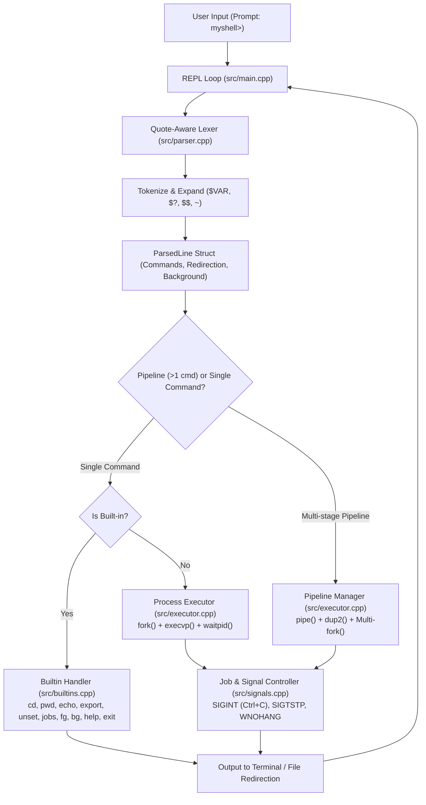

# Mini UNIX Shell (`myshell`)

[](https://en.cppreference.com/w/cpp/17)
[](https://pubs.opengroup.org/onlinepubs/9699919799/)
[](Makefile)
[](tests/run_tests.sh)

A modular, POSIX-compliant Unix command-line interpreter developed in **modern C++ (C++17)** for Linux systems. This project simulates core operating systems mechanisms: low-level process lifecycle management, a quote-aware and variable-expanding command tokenizer, file descriptor redirection, arbitrary multi-stage pipelines, asynchronous job control, and signal handling.

---

## 🚀 Key Features

* **Process Lifecycle & Execution:** Spawns and manages external Linux binaries via `fork()`, `execvp()`, and `waitpid()` with exit status propagation (`$?`).
* **Quote-Aware Parser & Lexer:** Custom state-machine tokenizer supporting:
  * Single quotes (`'...'` for literal strings)
  * Double quotes (`"..."` for grouped arguments with variable expansion)
  * Escape sequences (`\ `, `\"`, `\\`)
  * Comments (`#` ignored until end of line)
  * Attached operators without whitespace (e.g. `cat<input>output`)
* **Dynamic Variable Expansion:** Resolves environment variables (`$VAR`), exit codes (`$?`), shell PID (`$$`), and home directory shortcuts (`~`).
* **Stream & File I/O Redirection:** Supports input (`<`), output overwrite (`>`), and output append (`>>`) redirection using `open()`, `dup2()`, and `close()`, with file descriptor save/restore mechanics for built-in commands.
* **Arbitrary Multi-Stage Pipelines:** Chains $N$ concurrent processes (`cmd1 | cmd2 | ... | cmdN`) using Unix pipes (`pipe()`) and file descriptor duplication (`dup2()`), cleanly closing all pipe ends to prevent leaks.
* **Wildcard Globbing Expansion:** Automatic pattern expansion for `*`, `?`, and `[...]` using POSIX `glob()`.
* **Job Control & Asynchronous Execution:** Run background processes with `&`, view active jobs (`jobs`), bring to foreground (`fg`), and resume in background (`bg`).
* **POSIX Signal Handling:** Graceful signal management for `SIGINT` (Ctrl+C), `SIGTSTP` (Ctrl+Z), and non-blocking zombie process reaping (`waitpid` with `WNOHANG`).

---

## 🏛️ System Architecture



---

## 📁 Repository Structure

```text
Mini_UNIX_Shell/
├── Makefile                     # C++17 build automation configuration
├── README.md                    # Project documentation & usage guide
├── problem-statement.md         # Full project assignment brief & specifications
├── docs/
│   ├── PROJECT_REPORT.md        # Comprehensive technical report & architecture guide
│   └── implementation-roadmap.md# 8-phase implementation roadmap & test scenarios
├── src/
│   ├── main.cpp                 # REPL loop, prompt management, and signal loop
│   ├── parser.h / parser.cpp    # State-machine tokenizer, quote handling, and variable expansion
│   ├── executor.h / executor.cpp# Process lifecycle, pipeline plumbing, and redirection
│   ├── builtins.h / builtins.cpp# Shell built-in commands and background job table
│   └── signals.h / signals.cpp  # POSIX sigaction handlers and signal routing
└── tests/
    ├── run_tests.sh             # Test suite launcher
    ├── test_runner.py           # Exhaustive 22-test automated regression suite
    ├── basic.txt                # Sample basic command scenarios
    ├── redirection.txt          # Redirection test scenarios
    ├── pipes.txt                # Pipeline test scenarios
    ├── background.txt           # Background execution scenarios
    └── all-features.txt         # End-to-end integration command list
```

---

## 🛠️ Built-in Commands Reference

| Command | Usage | Description |
| :--- | :--- | :--- |
| `cd` | `cd [dir \| ~ \| -]` | Changes directory. Supports default (`$HOME`), home (`~`), and previous directory (`cd -`), updating `$PWD` and `$OLDPWD`. |
| `pwd` | `pwd` | Prints the absolute path of the current working directory. |
| `echo` | `echo [-n] [args...]` | Prints text to stdout. Supports `-n` flag to omit the trailing newline. |
| `export` | `export [VAR=VAL ...]` | Sets environment variables in the parent process. Invoked without arguments, lists all variables. |
| `unset` | `unset [VAR ...]` | Unsets environment variables in the parent process. |
| `jobs` | `jobs` | Lists active and suspended background processes with their job IDs. |
| `bg` | `bg <job_id>` | Resumes a suspended job in the background via `SIGCONT`. |
| `fg` | `fg <job_id>` | Brings a job to the foreground and waits for its completion. |
| `help` | `help` | Displays command documentation and usage guide. |
| `exit` | `exit [code]` | Terminates the shell with an integer exit code (defaults to 0). |

---

## ⚙️ Build and Run

### Prerequisites
* A Linux environment (Ubuntu, Debian, Fedora, Arch, WSL on Windows, or macOS)
* `g++` supporting C++17
* GNU `make`
* `python3` (for running the automated test suite)

### Build the Shell
```bash
make
```

### Run Interactively
```bash
./myshell
```

### Clean Build Artifacts
```bash
make clean
```

---

## 🧪 Running the Automated Test Suite

An exhaustive **22-test automated test harness** validates all features:

```bash
bash tests/run_tests.sh
```

**Test Output:**
```text
======================================================================
      Mini UNIX Shell Exhaustive CV & Feature Test Suite       
======================================================================
[Bullet 1: Process & Built-ins] External command execution (mkdir, ls, rmdir)... PASSED
[Bullet 1: Process & Built-ins] Exit status tracking ($? on success = 0)... PASSED
[Bullet 1: Process & Built-ins] Exit status tracking ($? on failure != 0)... PASSED
[Bullet 1: Process & Built-ins] Built-in cd, pwd, cd -, cd ~... PASSED
[Bullet 1: Process & Built-ins] Built-in echo with -n flag... PASSED
[Bullet 1: Process & Built-ins] Built-in help and exit... PASSED
[Bullet 2: Quote-Aware Parser] Single quotes (Literal preservation, no variable expansion)... PASSED
[Bullet 2: Quote-Aware Parser] Double quotes (Preserves spaces with variable expansion)... PASSED
[Bullet 2: Quote-Aware Parser] Backslash escape sequences (\ , \", \\)... PASSED
[Bullet 2: Quote-Aware Parser] Full-line and inline comments (#)... PASSED
[Bullet 2: Quote-Aware Parser] Environment variables ($VAR, export, unset)... PASSED
[Bullet 2: Quote-Aware Parser] Special variables ($$ PID and ~ Home)... PASSED
[Bullet 3: I/O & Pipelines] Output overwrite (> ) and Input (< ) redirection... PASSED
[Bullet 3: I/O & Pipelines] Output append (>> ) redirection... PASSED
[Bullet 3: I/O & Pipelines] Attached redirection operators without spaces (cat<in>out)... PASSED
[Bullet 3: I/O & Pipelines] 2-Stage Pipeline (cmd1 | cmd2)... PASSED
[Bullet 3: I/O & Pipelines] 3-Stage Pipeline (cmd1 | cmd2 | cmd3)... PASSED
[Bullet 3: I/O & Pipelines] 4-Stage Pipeline (cmd1 | cmd2 | cmd3 | cmd4)... PASSED
[Bullet 3: I/O & Pipelines] Pipeline combined with input (<) and output (>) redirection... PASSED
[Bullet 3: I/O & Pipelines] Wildcard Globbing expansion (*.cpp)... PASSED
[Bullet 4: Jobs & Signals] Background execution (&) and jobs list... PASSED
[Bullet 4: Jobs & Signals] Non-blocking process reaping (No zombie leaks)... PASSED
======================================================================
 TOTAL TESTS: 22
 PASSED:      22
 FAILED:      0
======================================================================
>>> ALL 22 TEST CASES PASSED PERFECTLY (100% COVERAGE)! <<<
```

---

## 💻 Example Usage

```bash
myshell> echo "Hello $USER, welcome to Mini UNIX Shell!"
Hello lanka, welcome to Mini UNIX Shell!

myshell> pwd
/mnt/c/Users/lanka/Desktop/programspractice/Mini_UNIX_Shell

myshell> export DEMO_VAR=SystemsProgramming

myshell> echo "Working on: $DEMO_VAR"
Working on: SystemsProgramming

myshell> ls src/*.cpp | grep -v 'main' | wc -l
4

myshell> echo 'alpha\nbeta\ngamma' > /tmp/demo.txt

myshell> cat < /tmp/demo.txt | grep 'beta'
beta

myshell> sleep 10 &
[1] 7842

myshell> jobs
[1] 7842 Running sleep 10

myshell> help
Mini UNIX Shell Built-in Commands:
  cd [dir]       Change current working directory (supports ~, -)
  pwd            Print current working directory
  echo [args]    Display a line of text (supports -n)
  export [K=V]   Set environment variable(s)
  unset [VAR]    Unset environment variable(s)
  jobs           List background and stopped jobs
  bg [job_id]    Resume suspended job in background
  fg [job_id]    Bring job to foreground
  help           Show this help message
  exit [code]    Exit the shell

myshell> exit 0
```


