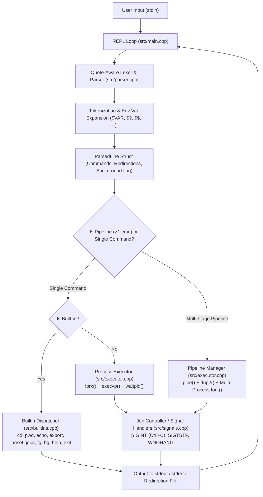

# Mini UNIX Shell (`myshell`) — Technical Project Report

---

## 🔗 Repository Links

- **GitHub Repository:** [https://github.com/lankaramakrishna5/Mini_UNIX_Shell](https://github.com/lankaramakrishna5/Mini_UNIX_Shell)


---

## 1. Executive Summary

**Mini UNIX Shell** is a modular Unix command-line interpreter developed in **modern C++ (C++17)** for Linux environments. It simulates core POSIX operating system mechanisms, providing process lifecycle management, a quote-aware and variable-expanding command tokenizer, file descriptor redirection, multi-stage arbitrary command pipelines, job control (background and foreground execution), and signal handling.

---

## 2. High-Level Architecture & Flow



---

## 3. Project Directory Structure

```
Mini_UNIX_Shell/
├── Makefile                               # Build automation file (C++17, g++)
├── README.md                              # Project documentation & overview
├── problem-statement.md                   # Full design brief & engineering specifications
├── LICENSE                                # Open-source license
├── Mini_UNIX_Shell_Project_Report.pdf     # Generated PDF technical report (Root)
├── docs/
│   ├── Mini_UNIX_Shell_Project_Report.pdf # Generated PDF technical report (Docs)
│   ├── Mini_UNIX_Shell_Project_Report.html# Formatted HTML report source
│   ├── PROJECT_REPORT.md                  # Markdown version of full project report
│   └── implementation-roadmap.md          # 8-phase development roadmap & test cases
├── src/
│   ├── main.cpp                           # Interactive REPL loop & stream error handling
│   ├── parser.h / parser.cpp              # Lexer, tokenizer, quote handling, and variable expansion
│   ├── executor.h / executor.cpp          # Process spawning, pipeline plumbing, and redirection
│   ├── builtins.h / builtins.cpp          # Internal shell commands and job control table
│   └── signals.h / signals.cpp            # POSIX signal handler configuration
└── tests/
    ├── run_tests.sh                       # Automated test harness
    ├── basic.txt                          # Basic execution tests
    ├── redirection.txt                    # Input/output redirection test scenarios
    ├── pipes.txt                          # Single and multi-stage pipeline tests
    ├── background.txt                     # Background execution tests
    └── all-features.txt                   # End-to-end integration test commands
```

---

## 4. Comprehensive Breakdown of Functionalities

### 4.1. Command Line Parsing & Lexical Analysis (`src/parser.cpp`)
- **Quote-Aware Tokenizer:**
  - **Single Quotes (`'...'`)**: Preserves all characters literally without interpreting escape sequences or variable symbols.
  - **Double Quotes (`"..."`)**: Allows embedded spaces within arguments, handles escape characters (`\"`, `\\`, `\$`, `\``), and performs variable expansion.
  - **Escape Characters (`\`)**: Allows escaping of arbitrary characters outside quotes.
  - **Comments (`#`)**: Ignores any trailing content from `#` until the end of the line.
- **Dynamic Variable Expansion:**
  - `$VAR` and `${VAR}`: Resolves environment variables from the process environment using `getenv()`.
  - `$?`: Expands to the exit code of the immediately preceding command.
  - `$$`: Expands to the current shell's process ID (`getpid()`).
  - `~` (Tilde): Expands leading `~` to the user's home directory (`$HOME`).
- **Data Representation:**
  - Encapsulates individual commands into `struct Command` with argument lists (`args`), input file (`inputFile`), output file (`outputFile`), and append mode flag (`append`).
  - Encapsulates lines into `struct ParsedLine` with a list of pipeline stages and a background execution flag (`background`).

---

### 4.2. Process Lifecycle & Execution (`src/executor.cpp`)
- **External Command Execution:**
  - Uses `fork()` to create child processes and `execvp()` to execute binaries discovered through the system `PATH`.
  - Uses `waitpid()` with foreground synchronization to retrieve exit statuses.
  - Handles exit status extraction via POSIX macros: `WIFEXITED`, `WEXITSTATUS`, `WIFSIGNALED`, and `WTERMSIG`.
- **Wildcard / Globbing Support:**
  - Evaluates filename patterns containing `*`, `?`, and `[...]` using POSIX `glob()` with `GLOB_TILDE` before command dispatch.

---

### 4.3. Stream & File Redirection (`src/executor.cpp`)
- **Input Redirection (`<`):** Opens source file in read-only mode (`O_RDONLY`) and duplicates the file descriptor onto `STDIN_FILENO` using `dup2()`.
- **Output Redirection (`>`):** Opens target file with `O_WRONLY | O_CREAT | O_TRUNC` (mode `0644`) and redirects `STDOUT_FILENO`.
- **Append Redirection (`>>`):** Opens target file with `O_WRONLY | O_CREAT | O_APPEND` (mode `0644`) to preserve existing content.
- **Built-in Redirection Safety:** When running built-in commands with redirection (e.g. `pwd > file.txt`), original standard streams are backed up via `dup()` and restored via `dup2()` after command execution.

---

### 4.4. Multi-Stage Pipelines (`src/executor.cpp`)
- **Arbitrary $N$-Stage Pipelines (`cmd1 | cmd2 | ... | cmdN`):**
  - Creates $(N-1) \times 2$ file descriptors using `pipe()`.
  - Connects the stdout of process $i$ to the stdin of process $i+1$ via `dup2()`.
  - Seamlessly integrates with file redirection on boundary commands (input redirection on first command, output redirection on last command).
  - Explicitly closes all pipe read/write file descriptors across both child processes and the parent process to avoid file descriptor leaks and process hangs.
  - Propagates and returns the exit status of the terminal stage in the pipeline.

---

### 4.5. Job Control & Background Execution (`src/builtins.cpp`, `src/executor.cpp`)
- **Background Execution (`&`):** Appending `&` spawns processes asynchronously without blocking the shell REPL.
- **Job Table Tracking (`g_jobs`):**
  - Tracks child PID, command string, and status (`Running` / `Stopped`).
  - Prints job registration notification: `[job_id] <pid>`.
- **Asynchronous Zombie Reaping:**
  - `removeFinishedJobs()` runs on every REPL cycle and before job listings.
  - Uses `waitpid(-1, &status, WNOHANG | WUNTRACED | WCONTINUED)` to clean terminated zombie processes without blocking.
- **Job Control Commands:**
  - `jobs`: Lists all tracked background and stopped jobs with their indices and status.
  - `bg <job_id>`: Resumes a stopped job in the background by sending `SIGCONT`.
  - `fg <job_id>`: Resumes a job, brings it to the foreground, and waits on it with `waitpid()`.

---

### 4.6. Built-in Commands Reference

| Command | Syntax / Usage | Description |
| :--- | :--- | :--- |
| `cd` | `cd [dir \| ~ \| -]` | Changes directory. Supports home default (`~`), and previous directory switching (`cd -`) updating `$PWD` and `$OLDPWD`. |
| `pwd` | `pwd` | Prints the absolute path of the current working directory via `getcwd()`. |
| `echo` | `echo [-n] [args...]` | Displays arguments to stdout. Supports `-n` flag to omit the trailing newline. |
| `export` | `export [VAR=VALUE ...]` | Sets or updates environment variables in the parent process using `setenv()`. Lists all environment variables when invoked without arguments. |
| `unset` | `unset [VAR ...]` | Removes environment variables using `unsetenv()`. |
| `jobs` | `jobs` | Lists active and stopped background processes. |
| `bg` | `bg <job_id>` | Resumes a suspended job in the background via `SIGCONT`. |
| `fg` | `fg <job_id>` | Brings a background/suspended job to the foreground and waits for completion. |
| `help` | `help` | Displays built-in command documentation and usage guide. |
| `exit` | `exit [code]` | Terminates the shell process with the specified integer return code (defaults to 0). |

---

### 4.7. Signal Handling (`src/signals.cpp`)
- Configured using the POSIX `sigaction()` interface with `SA_RESTART`:
  - **`SIGINT` (Ctrl+C):** Caught in the parent shell; outputs a clean newline and maintains an active prompt without terminating the shell.
  - **`SIGTSTP` (Ctrl+Z) & `SIGQUIT` (Ctrl+\):** Ignored (`SIG_IGN`) by the parent shell.
  - **Child Signal Dispositions:** Foreground child processes restore default signal behavior (`SIG_DFL`), while background child processes ignore terminal interrupt signals (`SIG_IGN`).

---

## 5. Build, Execution & Test Instructions

### Compilation
```bash
# Build the binary
make

# Clean object files and binary
make clean
```

### Running the Shell
```bash
./myshell
```

### Running Automated Test Suite
```bash
bash tests/run_tests.sh
```
